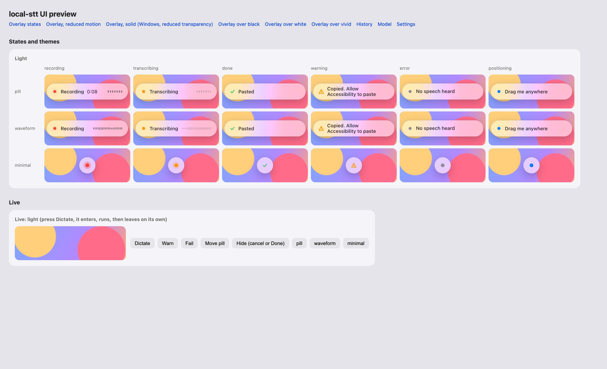
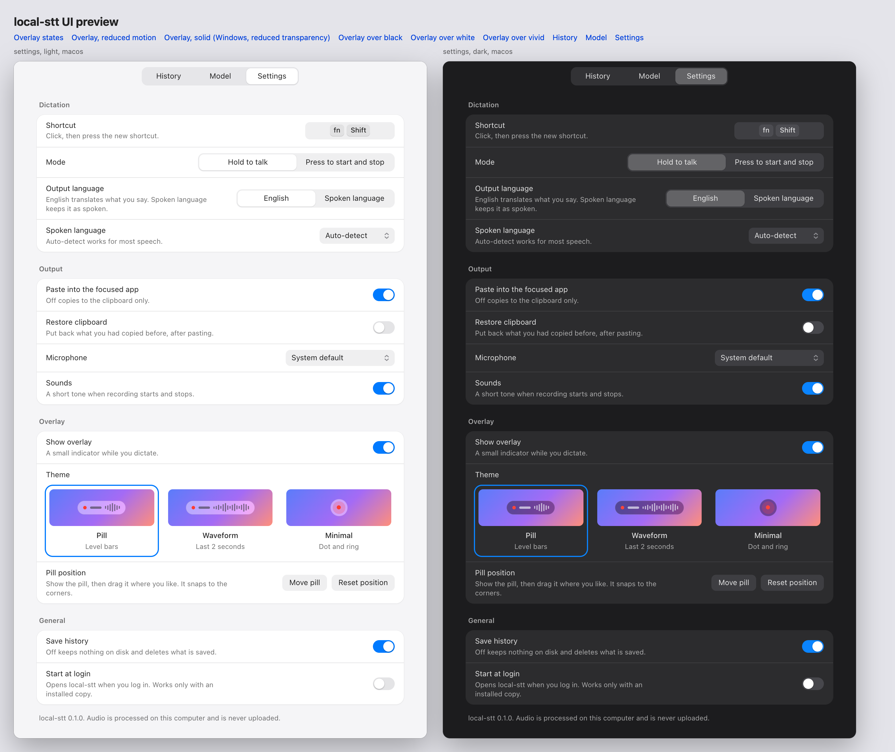
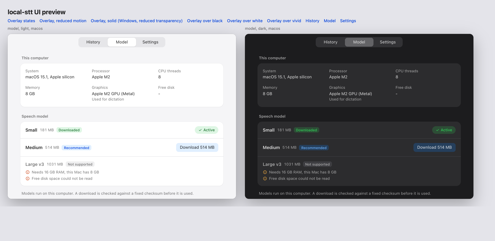

<div align="center">

# local-stt

**Free, private, offline speech-to-text for macOS and Windows.**
Hold a shortcut, talk, let go: your words are typed into any app.
A small Whisper model runs on your own laptop. No cloud, no account, no subscription. Free forever.

[](https://github.com/mariadb-RupeshBiswas/local-stt/actions/workflows/ci.yml)
[](LICENSE)


</div>

```bash
uvx local-stt
```

---

## Why local-stt

- **Free forever.** MIT licensed open source. No trial, no paid tier, no usage limits.
- **Private by design.** Your voice is turned into text on your own computer. Audio never leaves your device and is never written to disk.
- **Works offline.** After a one-time model download, dictation never needs the internet.
- **Push-to-talk voice typing everywhere.** Mail, Slack, docs, your code editor, the browser: if it has a text cursor, local-stt can type into it.
- **Speaks your language.** Dictate in English or Hindi (and the other languages Whisper knows). By default everything comes out as English text.
- **Small and fast.** The default model is 181 MB. On an Apple M4 Pro a short sentence comes back in about half a second.
- **Hands-free when you want it.** Hold to talk, or press a second shortcut to keep listening while you think out loud.
- **Live preview, tidy result.** See your words as you speak; Smart formatting turns "point one, point two" into a numbered list.
- **No telemetry.** No analytics, no crash reporting, no account. The only optional ping is a once-a-day version check you can switch off.

## How it works



1. Hold **Fn + Shift** on a Mac, or **Ctrl + Alt** on Windows. Change it any time in Settings.
2. Speak. A small glass recording pill shows a red dot and your live microphone level, with a live preview of your words above it.
3. Let go. Your words are transcribed on your laptop, tidied, copied to the clipboard and pasted where your cursor is.

**Hands-free:** press **Fn + Shift + Space** (Windows: **Ctrl + Alt + Space**) to start listening, and press it again to stop. Already holding push-to-talk? Add Space to switch to hands-free without stopping. **Esc** cancels either way. A single recording stops and pastes after 5 minutes.

Every dictation is kept in a local history you can search and copy from. Click Select to tick the ones you no longer need (one, a whole day, or all of them) and delete them, or switch history off.

## Install

You need [uv](https://docs.astral.sh/uv/getting-started/installation/), the fast Python package manager. You do not need Python, Rust or anything else.

> The first release is not on PyPI yet. Until it is, build from source in a minute or two: see [CONTRIBUTING.md](CONTRIBUTING.md).

```bash
uvx local-stt                # installs the app (Applications or Start menu, plus a terminal command) and opens it
uvx local-stt install        # install without opening
local-stt --autostart on     # start it when you log in
uvx local-stt demo           # a 30-second tour with sample data; nothing is recorded or pasted
```

Started from a terminal, local-stt runs as its own app, not as part of the terminal: you can close the terminal, and macOS asks for permissions in local-stt's name. On first start it downloads the default speech model (181 MB, checked against a pinned SHA-256 checksum) and puts a microphone icon in your menu bar or system tray. **Settings > General > Install** does the same as `install`, and turning on **Start at login** installs it first if needed.

### First run on macOS

macOS asks for two permissions, in local-stt's name. Both are needed and both stay on your Mac:

- **Microphone**: to hear you while you hold the shortcut.
- **Accessibility**: to notice the shortcut and to paste the text for you.

If the emoji picker opens when you press Fn, set **System Settings > Keyboard > Press fn key to** "Do Nothing".

## Settings

Open the app from the menu bar or tray icon.



| Setting | What it does | Default |
|---|---|---|
| Push to talk | Hold to talk, release to paste. Any combo with at least one modifier | Fn + Shift (Mac), Ctrl + Alt (Windows) |
| Hands-free | Press once to start listening, again to stop; can be turned off | Fn + Shift + Space (Mac), Ctrl + Alt + Space (Windows) |
| Output language | English (translate) or keep the language you spoke | English |
| Spoken language | Auto-detect or a fixed language | Auto-detect |
| Paste | Paste into the focused app, or only copy to the clipboard | Paste |
| Smart formatting | Numbered lists from "point one, point two", removes "uh" and "um", fixes spacing | On |
| Restore clipboard | Put your previous clipboard back after pasting | Off |
| Microphone | System default or a specific input | System default |
| Recording style | Pill, Waveform or Minimal | Pill |
| Live transcription | Shows your words above the pill while you speak (the pasted text is the final, more accurate pass) | On |
| Sounds | Short start and stop sounds | On |
| History | Keep a local history of dictations | On |
| Start at login | Launch quietly when you log in | Off |
| Check for updates | Looks for a new version once a day; an update shows as a menu item and a banner, never a pop-up | On |
| Troubleshooting log | Keeps app events (starts, errors, timings) on this computer, never your words, audio or keys | On |

The recording pill can be dragged anywhere, on any monitor. It snaps to corners and edges and remembers where you put it.

## Models

local-stt checks your computer (memory, processor, graphics, free disk) and only offers models that will run well on it. The best fit is marked **Recommended**; models that will not run well are greyed out with the reason.

| Model | Download | Good for | Needs |
|---|---|---|---|
| Whisper Small (default) | 181 MB | Everyday dictation on any modern laptop | 4 GB RAM |
| Whisper Medium | 514 MB | Better accuracy, accents, noisy rooms | 8 GB RAM, Apple Silicon or 8+ CPU threads |
| Whisper Large v3 | 1.0 GB | Best accuracy | 16 GB RAM and Apple Silicon |

Run `local-stt doctor` to see your hardware and which models fit, right in the terminal.



## Privacy and security

- Speech recognition runs locally with [whisper.cpp](https://github.com/ggml-org/whisper.cpp). Audio stays in memory and is discarded after each dictation.
- The app talks to the network for three things only: downloading a model from Hugging Face over HTTPS (verified against a pinned checksum on download and again when it loads); a once-a-day version check against pypi.org that sends nothing but the request itself (you can turn it off); and, only when you click Install and Restart, uv fetching the new release from PyPI.
- Text is put on the clipboard marked as private, so clipboard managers, Windows clipboard history and cloud clipboard skip it. On a Mac with Handoff on, Universal Clipboard can still pass it to your own nearby devices.
- The shortcut listener only checks whether your chosen combo is held. It never records or stores any other keys.
- The troubleshooting log records events such as "recording stopped: 4.2 s" or "paste blocked", never what you said, audio, key presses, clipboard contents or microphone names. It stays on your computer; turning it off deletes it.
- History and settings are plain local files readable only by your user account. History can be switched off, cleared, or trimmed to the dictations you pick, at any time.
- Releases are built in GitHub Actions, published with PyPI Trusted Publishing and carry build provenance attestations.

See [SECURITY.md](SECURITY.md) to report a vulnerability privately.

## FAQ

**Is it really free?**
Yes. MIT licensed, no paid features, no limits, no account.

**Does it work without internet?**
Yes, after the first model download.

**Which languages can I speak?**
Any language Whisper supports, including English and Hindi. Text comes out in English by default; switch "Output language" to keep the spoken language.

**Does it work on Windows?**
Yes, Windows 10 and 11 on x64. The default shortcut is Ctrl + Alt.

**How is this different from built-in dictation?**
It runs a model you choose, entirely on your device, translates to English if you want, keeps a searchable history, and works the same way on Mac and Windows.

## Troubleshooting

Something not working? Open Settings > Troubleshooting and click **Export Report**, or run `local-stt diagnostics` (it works even when the app will not start). You get one text file, shown in Finder or Explorer, with:

- app version, how it was started, and your settings (the microphone shows only as "system default" or "a chosen device");
- your computer's OS, processor, memory, graphics and free disk;
- which models are downloaded, and how many dictations history holds (never their text);
- on macOS, a short summary of any local-stt crash in the last 30 days (the cause and the crashed thread, without device ids or paths);
- recent error output and the troubleshooting log.

Your home folder shows as `~` and your user name as `<user>`. Nothing is sent anywhere: read the file, then attach it to an issue or send it to whoever is helping you. Plain text also works well pasted into an AI assistant.

## Updating

local-stt checks for a new version once a day (Settings > General > Check automatically). When one is out you see an "Update to ..." item in the menu bar or tray and a banner in the app with **Install and Restart**, **Release Notes**, **Later** and **Skip This Version**. From a terminal: `local-stt check-update`.

On macOS, each new version is a new program to the system, so it may ask for Microphone and Accessibility again after an update.

## Uninstall

```bash
local-stt uninstall          # removes the app, the terminal command and the login item
```

Your settings, history and models live in `~/Library/Application Support/local-stt` (macOS) or `%APPDATA%\local-stt` (Windows). Delete that folder to remove everything.

## Contributing

Bug reports, ideas and pull requests are welcome. See [CONTRIBUTING.md](CONTRIBUTING.md).

## License

[MIT](LICENSE). Whisper models are released by OpenAI under the MIT license; whisper.cpp is MIT licensed by ggml-org.

---

<sub>Keywords: free speech to text, offline dictation, local Whisper, private voice typing, voice to text for Mac, voice to text for Windows, push to talk dictation, Hindi to English speech translation, open source Wispr Flow alternative, open source Superwhisper alternative, no cloud transcription.</sub>
